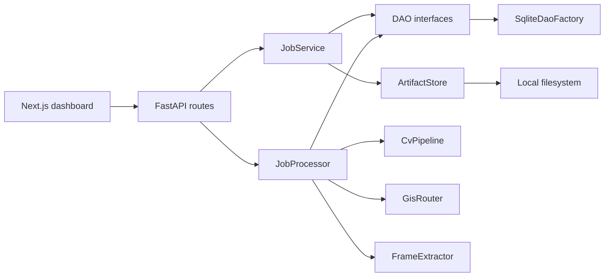

# Architecture

## Runtime shape

```text
Next.js dashboard (:3000)
        |
        | typed fetch (frontend/src/lib/api-client.ts)
        v
FastAPI (:8000)
  routes (thin) --> JobService (facade)
                      |-- DaoFactory --> SQLite DAOs
                      |-- ArtifactStore --> local disk
        |
        | BackgroundTasks
        v
JobProcessor
  FrameExtractor  --> frames (Artifact metadata + bytes)
  CvPipeline      --> Detection rows
  GisRouter       --> LandingZone rows + Route
```



## Layers

| Layer | Path | Allowed to know |
| --- | --- | --- |
| HTTP | `backend/api/` | Pydantic schemas, `Depends`, `JobService`, `JobProcessor` |
| Facade | `backend/services/job_service.py` | `DaoFactory`, `ArtifactStore`, schemas ↔ domain |
| Worker | `backend/tasks/async_workers.py` | Service interfaces + DAOs; updates `Job.status` |
| Service interfaces | `backend/services/interface/` | Domain types only |
| Stubs / future impls | `backend/services/stubs/` (then new packages) | Domain types; may use `ArtifactStore` when you add it |
| DAO interfaces | `backend/dao/interface/` | Domain types |
| SQLite | `backend/dao/sqlite/` | SQL + domain mapping |
| Artifact store | `backend/storage/` | bytes + `storage_key` |
| Composition | `backend/main.py` | Concrete types |

Routes must not contain business logic. They parse, call a service, enqueue work, return a schema.

## Composition root

[`backend/main.py`](../../backend/main.py) `create_app()`:

1. `Settings()` from env (`SAR_*`).
2. `SqliteDaoFactory.initialize(database_path)`
3. `LocalArtifactStore.initialize(artifacts_dir)`
4. Stub `FrameExtractor`, `CvPipeline`, `GisRouter`
5. `DefaultServiceFactory(...)` + `JobProcessor(...)`
6. Store factory + processor on `app.state` for FastAPI `Depends`

Tests call `create_app(Settings(database_path=tmp, artifacts_dir=tmp))` so they never touch `backend/data/`.

## Job lifecycle

```text
POST /telemetry or POST /telemetry/upload
  validate Pydantic
  persist DroneTelemetry
  persist Job(status=queued)
  optional: ArtifactStore.put + ArtifactDao.save + job.video_artifact_id
  BackgroundTasks.add_task(process_job, job.id)
  return JobOut (still queued)

process_job(job_id)
  status = processing
  frames = FrameExtractor.extract(video) or []
  detections = CvPipeline.process(job, frames)
  save detections; job.detection_ids = [...]
  (lzs, route) = GisRouter.route(job, telemetry)
  save LZs + route; set ids
  status = completed
  on exception: status = failed, failure_reason = classified
```

## Frontend MVP

```text
page.tsx (View implementation)
    --> DashboardPresenter (no React)
          --> ApiClient
                --> POST /telemetry, GET /jobs/{id}
    --> StreamViewer (placeholder panes)
    --> TacticalMap --> dynamic TacticalMapCanvas (Leaflet)
```

Person-detection alerts render when `job.detections` contains `className === "person"`. Stubs return `[]`, so the banner is wired but idle.

## Persistence schema (SQLite)

Tables: `telemetry`, `jobs`, `artifacts`, `detections`, `landing_zones`, `routes`.

- `jobs.detection_ids_json` / `landing_zone_ids_json` are JSON string arrays (denormalized ids for the job row).
- `routes.waypoints_json` is a JSON array of `{lat, lng, elevation_meters}`.
- Foreign keys: job requires telemetry first; artifacts require job first; video id is written on a job update after the artifact row exists.

Schema lives in [`backend/dao/sqlite/connection.py`](../../backend/dao/sqlite/connection.py).

## Config

| Env | Default | Meaning |
| --- | --- | --- |
| `SAR_DATABASE_PATH` | `data/sar.db` | SQLite file (relative to process cwd; `start_dev.sh` sets an absolute path) |
| `SAR_ARTIFACTS_DIR` | `data/artifacts` | Binary root |
| `SAR_API_KEY` | unset | Optional `X-API-Key` |
| `SAR_CORS_ORIGINS` | `http://localhost:3000` | Comma-separated |
| `NEXT_PUBLIC_API_URL` | `http://localhost:8000` | Frontend API base |

## Swapping infrastructure later

Add one factory implementation. Do not change `JobService` or routes.

```text
DaoFactory          -> SqliteDaoFactory today
                       DynamoDaoFactory / PostgresDaoFactory later
ArtifactStore       -> LocalArtifactStore today
                       S3ArtifactStore later
CvPipeline          -> StubCvPipeline today
                       VisDroneYoloPipeline later
GisRouter           -> StubGisRouter today
                       UsgsAStarRouter later
FrameExtractor      -> StubFrameExtractor today
                       OpenCvSahiExtractor later
```
